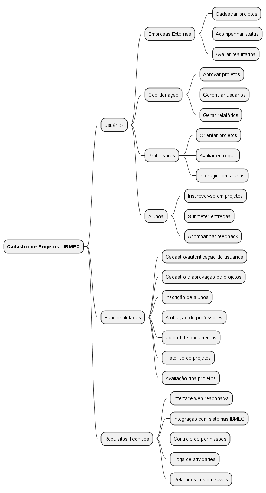

## **Design Thinking**

### **1. Capa**

- Título do Projeto
- Nome da Equipe
- Data
- Logo da Empresa/Organização (se aplicável)

---

### **2. Introdução**

- **Contexto do Projeto**: 

    O IBMEC busca fortalecer a integração entre o meio acadêmico e o mercado. Surge então a oportunidade de criar um aplicativo web que centralize o cadastro, a gestão e o acompanhamento de projetos, promovendo maior visibilidade e organização.

- **Objetivo**: 

    O objetivo do projeto é desenvolver um aplicativo web que facilite a interação entre empresas, professores, coordenação e alunos, possibilitando que projetos sejam cadastrados, aprovados, orientados e executados de maneira prática.

- **Público-Alvo**:  
    Empresas externas: que desejam propor desafios e projetos.

    Coordenação: responsável por validar e organizar as propostas.
    
    Professores: que atuarão como orientadores dos 
    projetos.
    
    Alunos do IBMEC: que poderão participar ativamente dos projetos.

- **Escopo**:

    Empresa: Cadastro da empresa e submissão de propostas de projeto com descrição, requisitos e objetivos.

    Professor/Coordenação: Dashboard para visualizar, aprovar ou recusar projetos, além de atribuir orientadores e acompanhar o andamento.

    Aluno: Visualização de projetos disponíveis e acompanhamento do status da aplicação.

---

### **3. Fases do Design Thinking**

#### **3.1. Empatia**

- **Pesquisa**:
    Site 1: Plataforma A
 
    

    Funcionalidades:

    1.	Unifica a gestão de projetos acadêmicos, de extensão, TCCs e estágios em um único sistema.

    2.	O professor consegue acompanhar e enviar feedbacks sobre projetos em andamento.

    3.	A plataforma permite que a Instituição consiga projetos de empresas e comunidades para aproximar o aluno de desafios reais.

    Site 2: Zoho Projects

    

    Funcionalidades:

    1.	Papéis e permissões customizáveis (Clientes, Gerente de Projeto, Administrador e Membro), algo similar ao que nosso projeto necessita.

    2.	Os projetos podem ser divididos em fases, listas de tarefas e subtarefas.

    3.	Relatórios que geram insights como: quem resolveu a maioria dos problemas e divisão de horas de trabalho entre os membros da sua equipe.

    Site 3: Asana

    

    Funcionalidades:

    1.	Permite criar projetos, dividir em tarefas e subtarefas, atribuir responsáveis e prazos.

    2.	Papéis definidos: administradores, responsáveis, colaboradores e convidados.

    3.	Relatórios de progresso e dashboards visuais que mostram status das tarefas.

    Site 4: Artia

    

    Funcionalidades:

    1. Quadro Kanban.

    2. Apontamento de horas.

    3. Gantt avançado. 

    4. EAP.

    5. Relatórios financeiros.  

    6. Dashboards em português.

- **Personas**: 

    - **Empresas externas:** cadastrar projetos, acompanhar status, avaliar resultados.
    - **Coordenação:** aprovar projetos, gerenciar usuários, gerar relatórios.
    - **Professores:** orientar projetos, avaliar entregas, interagir com alunos.
    - **Alunos:** inscrever-se em projetos, submeter entregas, acompanhar feedback.

#### **3.2. Definição**

- **Problema Central**:

    Como podemos criar uma plataforma centralizada que conecte empresas externas, coordenação, professores e alunos do IBMEC, facilitando o cadastro, a validação e o acompanhamento de projetos acadêmicos em parceria com o mercado?

- **Pontos de Vista (POV)**:

    Empresas externas precisam de um meio rápido e estruturado para cadastrar projetos e acompanhar seus resultados.

    Alunos precisam de um espaço único e transparente onde possam visualizar oportunidades de projetos e acompanhar seu progresso.

    Professores precisam de uma ferramenta que permita orientar alunos de forma organizada e acompanhar a evolução dos projetos.

    Coordenação precisa de um sistema confiável para validar projetos, monitorar o andamento e garantir o alinhamento com os objetivos pedagógicos da instituição.

#### **3.3. Ideação**

- **Brainstorming**:

    ##### 1. Usuários do Sistema
    - **Empresas externas:** cadastrar projetos, acompanhar status, avaliar resultados.
    - **Coordenação:** aprovar projetos, gerenciar usuários, gerar relatórios.
    - **Professores:** orientar projetos, avaliar entregas, interagir com alunos.
    - **Alunos:** inscrever-se em projetos, submeter entregas, acompanhar feedback.

    ##### 2. Funcionalidades Principais
    - Cadastro e autenticação de usuários por perfil.
    - Cadastro de projetos com campos personalizados (nome, descrição, área, empresa proponente, etc).
    - Fluxo de aprovação de projetos pela coordenação.
    - Inscrição de alunos em projetos disponíveis.
    - Atribuição de professores orientadores.
    - Espaço para upload de documentos e entregas.
    - Sistema de notificações (e-mail, painel).
    - Dashboard com indicadores para cada perfil.
    - Histórico de projetos realizados.
    - Avaliação dos projetos por empresas e professores.

    ##### 3. Requisitos Técnicos
    - Interface web responsiva.
    - Controle de permissões por perfil.
    - Logs de atividades e auditoria.
    - Exportação de dados (PDF, Excel).

    ##### 4. Outros Pontos
    - Suporte a anexos de diferentes formatos.
    - Filtros de busca avançada por área, status, empresa, etc.
    - Relatórios customizáveis para coordenação.

#### **3.4. Prototipagem**

- **Descrição do Protótipo**: Como a ideia foi transformada em um protótipo (esboço, modelo físico, digital, etc.).
- **Materiais Utilizados**: Recursos necessários para criar o protótipo.
- **Testes Realizados**: Como o protótipo foi testado.

---

### **4. Conclusão**

- **Resultados Obtidos**: O que foi alcançado com o projeto.
- **Próximos Passos**: O que ainda precisa ser feito ou implementado.
- **Aprendizados**: Lições aprendidas durante o processo.

---

### **5. Anexos**

- **Mapa Mental 1:**
 

---

## **Dicas para Criar o Documento**

- Use uma linguagem clara e objetiva.
- Inclua visualizações, como mapas de empatia, jornadas do usuário ou esboços de ideias.
- Adapte o documento conforme o estágio do projeto (ex.: um documento inicial pode focar mais na pesquisa, enquanto um final pode detalhar a solução).

Esse modelo é flexível e pode ser ajustado conforme as necessidades do seu projeto ou da sua equipe. O importante é que o documento reflita o processo colaborativo e iterativo do Design Thinking.
