## Introdução

A construção do protótipo de alta fidelidade auxilia a equipe de desenvolvimento a encontrar um nível de detalhes abrangentes, extrair funcionalidades, testar usabilidade, e também fornece uma base para o gerenciamento do projeto pois com o protótipo é possível realizar estimativas de quanto tempo será necessário desempenhar em cada funcionalidade.

## Protótipo de baixa fidelidade

### Versão 1.0

#### Home
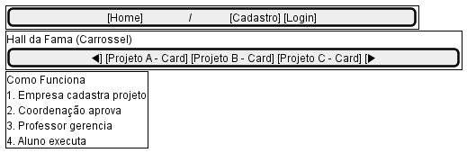

#### Cadastro/Login
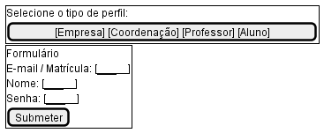

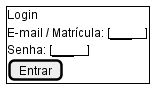

#### Dashboard Empresa/Formulário de Projeto
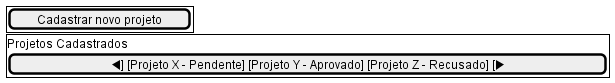

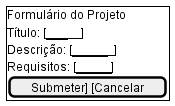

#### Dashboard Coordenação/Avaliação de Projeto
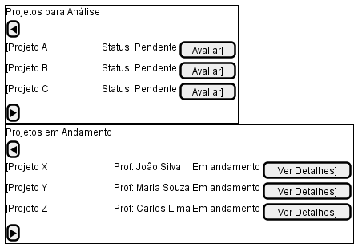

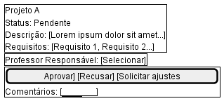

#### Dashboard Professor/Gerenciamento de Projeto
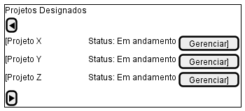

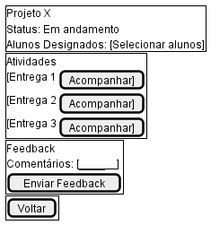

#### Dashboard Aluno/Projeto Detalhado
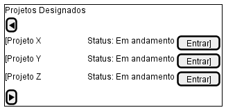

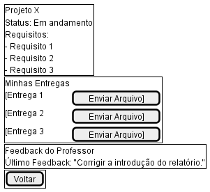

### Versão 2.0

## Conclusão

A partir da elaboração do protótipo foi possível ter uma noção inicial da interface do usuário, definindo fluxo, paleta de cores, botões, app bars e diversas outras funcionalidades

## Referências

> Material Design Color Tool. Disponível em:  https://material.io/resources/color/#!/?view.left=0&view.right=0

> PMI. Um guia do conhecimento em gerenciamento de projetos. Guia PMBOK® 5a. ed. EUA: Project Management Institute, 2013.

> Ferramenta Figma. Disponível em https://www.figma.com

